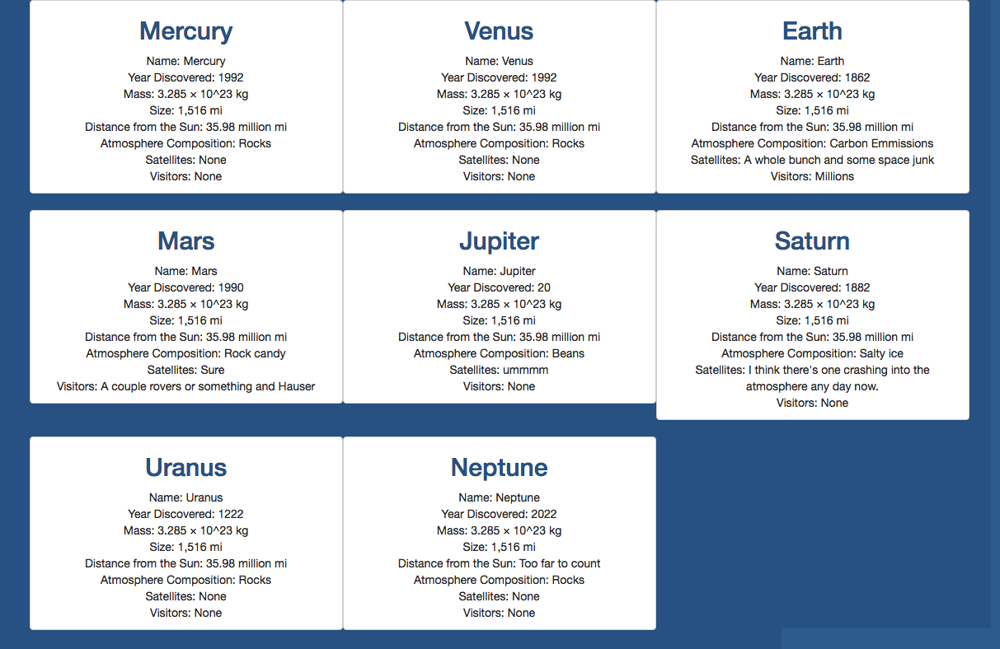

# solar_system

## Synopsis:

The solar system exercise is an individual project using bootstrap, grunt, and JavaScript. Each planet's information is held in its own js file and uses the same function to write to the dom.

## What to expect:

The planets and their information will show on the page in a card style layout.


## Requirements

You'll be creating a web page that will display important scientific data about all eight planets in our solar system. The information about each planet will be separate modules.

1. Each module will export a single function named `outputTo` that will accept a single argument. That argument's value will be the DOM element reference into which it will insert information about a planet.

    ```js
    function outputTo(domElement) {
      domElement.innerHTML += ...;
    }
    ```

2. Each module should output the following information.
    1. Name
    2. Year discovered
    3. Mass
    4. Size
    5. Distance from Sun
    6. Atmosphere composition
    7. Satellites
    8. Name of any probes/orbiters/explorers that have visited or landed on that planet
3. Create a main module that uses `require` to include each planet's module as a dependency and then subsequently calls the `outputTo()` method for each one, in the right order.

## Bonus stretch goal

Once you've got the basic implementation working, find a way to have the `outputTo()` only defined once, and still be able to output each planet's information to the DOM. It can't be defined in the **main** module.

### How to run (Node must be installed on your machine):
1. Go to: `https://www.npmjs.com/package/http-server` and install "http-server".  
2. Navigate to the project folder in command line interface and type: `http-server -p 8080`  
3. This will show at: `http://localhost:8080` in your internet browser.

```
git clone git@github.com:hagansmith/solar_system.git
cd solar_system
npm install http-server -g
hs -c-1
cd Ad/lib
npm install
```
Navigate to: http://localhost:8080
